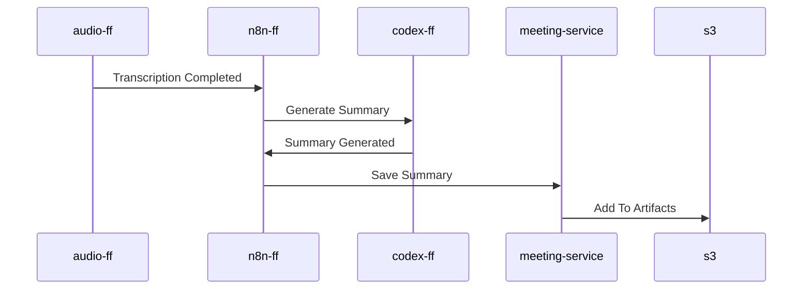

## N8n

N8n is responsible for:

- Initiate summary process;
- Handle AI Apps.

### How Summary Is Processed?

#### Additional Resources

- [How Meeting Is Transcribed?](./audio.md)
- [How Meeting Data Is Stored?](./storage.md)